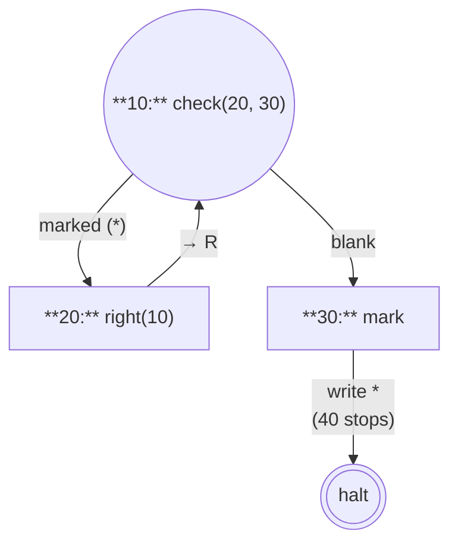
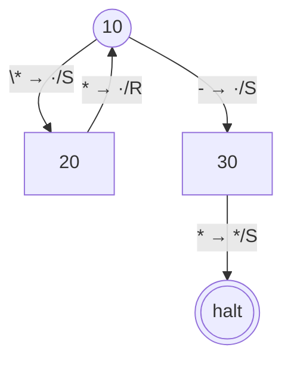
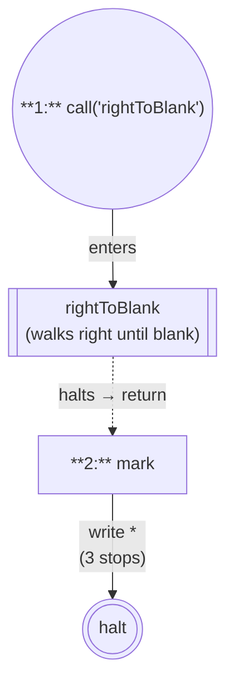
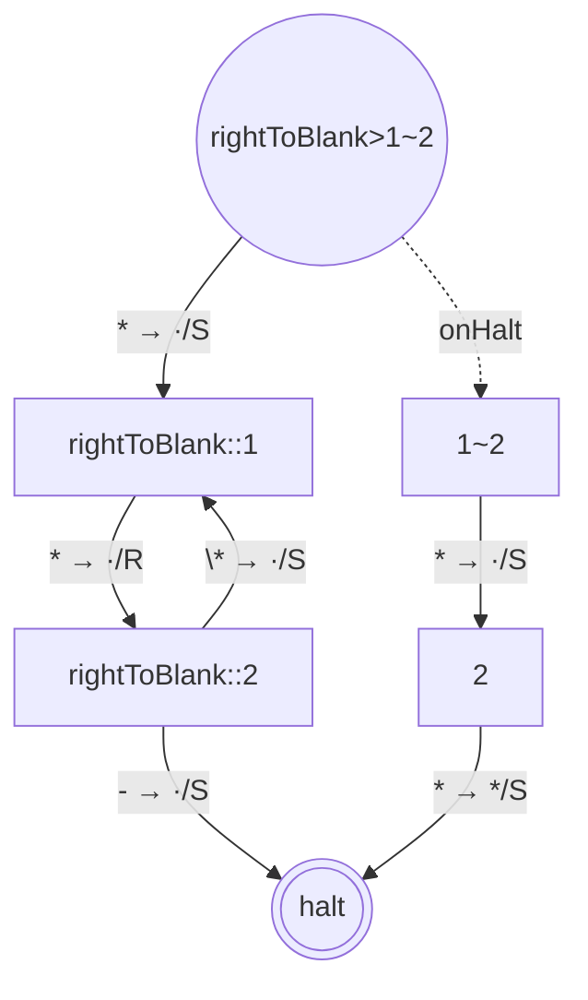

# @post-machine-js/machine

[](https://github.com/mellonis/post-machine-js/actions/workflows/main.yml)


A Post machine — a 2-symbol Turing-machine variant with a numbered-instruction program model — built on top of [`@turing-machine-js/machine`](https://github.com/mellonis/turing-machine-js).

<details>
<summary>Table of contents</summary>

- [Install](#install)
- [Quick start](#quick-start)
- [Classes](#classes) — [`PostMachine`](#postmachine) · [`Tape`](#tape)
- [Constants](#constants)
- [Custom symbols](#custom-symbols)
- [Commands](#commands) — [Classical](#classical-commands) · [Author's extensions](#authors-extensions)
- [Grouped instructions](#grouped-instructions)
- [Subroutines](#subroutines)
- [Naming convention](#naming-convention)
- [Introspection and equivalence](#introspection-and-equivalence) — [Visualization](#visualization--tomermaid--statetograph) · [Structural summary](#structural-summary--summarizepostmachine) · [Behavioral equivalence](#behavioral-equivalence--equivalentpostmachines)
- [Debugging](#debugging)
- [Links](#links)

</details>

## Install

`@post-machine-js/machine` declares `@turing-machine-js/machine` as a **peer dependency**, so both share a single instance of the upstream engine. The upstream library has runtime singletons (`haltState`, `ifOtherSymbol`, and the `Symbol`-keyed `movements` constants) whose identity is checked at runtime; duplicate copies in the bundle would break those checks.

```sh
npm install @turing-machine-js/machine @post-machine-js/machine
```

## Quick start

The Post machine alphabet has only two symbols — blank (` `) and mark (`*`). A program is a numbered map of instructions. The example below walks the head right while the cell under it is marked, then writes a mark on the first blank it finds:

```javascript
import { PostMachine, check, mark, right, stop, Tape } from '@post-machine-js/machine';

const machine = new PostMachine({
  10: check(20, 30),  // marked → go to 20 (step right); blank → go to 30 (mark)
  20: right(10),      // step right, then re-check at 10
  30: mark,           // write '*'; falls through to 40
  40: stop,
});

machine.replaceTapeWith(new Tape({
  alphabet: machine.tape.alphabet,
  symbols: ['*', '*', ' '],
}));

await machine.run();
console.log(machine.tape.symbols.join('').trim()); // ***
```

Each instruction is a command. Used bare (`mark`, `right`, `erase`), it falls through to the next numbered instruction; called with an index (`mark(20)`), it jumps to instruction `20`. `check(ix1, ix0)` branches — `ix1` if the current cell is marked, else `ix0`. `stop` halts.

The state graph for the example above:



The `40: stop` instruction is elided in the graph — `stop` halts the machine, so the transition from `30: mark` flows straight to halt rather than through an intermediate state.

<details>
<summary>Same graph, as the engine actually emits via <code>toMermaid(State.toGraph(machine.initialState, machine.tapeBlock))</code>:</summary>



Reading the engine output:

**Nodes.** Each `s\d+` is a Mermaid-internal node ID; the bracketed/parenthesized text is the state's display label. `s0` is always `haltState`. Node shapes:
- `(((label)))` — halt state
- `(("label"))` — entry state (the one passed as `initialState`)
- `["label"]` — intermediate state

The labels are PostMachine's instruction-derived names — `"10"`, `"20"`, `"30"` map directly to the instruction indices in the program. The wrapper composite shape (`"<outer>><continuation>"`) doesn't appear in this example because there are no calls or groups; see the [Subroutines](#subroutines) section for that.

**Edges.** Compact `read → write/move` syntax:
- **Read side**: `\*` is the literal mark symbol; `-` is `ifOtherSymbol` (the catch-all when there are also explicit symbol edges from the same state); `*` (without backslash) is the sole-transition match-all — used when a state has only one outgoing edge that matches everything.
- **Write side**: `·` is "keep" (no write); `*` is the literal mark symbol; ` ` (or whatever blank glyph the alphabet uses) is the literal blank.
- **Move**: `S` = stay, `L` = left, `R` = right.

</details>

## Classes

### PostMachine

The runtime. Subclasses `TuringMachine` from `@turing-machine-js/machine`: the constructor walks the numbered instruction list, materializes a state graph using the upstream `State` and `Reference` primitives, and runs it. Subroutines are introduced by adding string-keyed groups to the program (see [Subroutines](#subroutines) below).

**Constructor.** `new PostMachine(instructions, options?)` — `instructions` is the numbered-instruction map (with optional string-keyed subroutine groups); `options` is `{ blankSymbol?, markSymbol? }` (see [Custom symbols](#custom-symbols)).

**Methods.**
- `run({ stepsLimit?, onStep?, __onPause? } = {})` → `Promise<void>`. Runs to halt or until `stepsLimit` (default `1e5`) is exhausted. `onStep(m: MachineState)` fires once per applied transition; `__onPause` forwards to the engine's debugger (see [Debugging](#debugging)).
- `runStepByStep({ stepsLimit? } = {})` → `Generator<MachineState>`. Synchronous step-at-a-time execution; the consumer drives the loop with `for ... of` or `.next()`.
- `replaceTapeWith(newTape)` — swap the active tape. Build the new tape against `machine.tape.alphabet` so symbol identities match the machine's interned alphabet.

**Properties.**
- `tape` — the active `Tape`. Equivalent to `tapeBlock.tapes[0]`.
- `tapeBlock` — the upstream `TapeBlock` wrapping `tape`. Pass to upstream utilities (`State.toGraph`, `summarize`, `equivalentOn`) when reaching past PostMachine.
- `initialState` — the entry `State` of the assembled state graph. Pass alongside `tapeBlock` to the upstream graph utilities.

### Tape

Reexported from [`@turing-machine-js/machine`](https://github.com/mellonis/turing-machine-js/tree/master/packages/machine). Post machine tapes use a 2-symbol alphabet — `' '` / `'*'` by default, but **the two glyphs are configurable per machine instance** (see [Custom symbols](#custom-symbols)). Whatever pair you pass in becomes the blank/mark for that machine; `mark`, `erase`, `check`, and the engine's `Tape` all read those glyphs from the per-instance alphabet at build time. Useful for rendering / visualization (e.g. the `demo.machines.mellonis.ru` interactive playground lets users choose any two characters, then runs the machine against tapes built on that alphabet), interop with other tape formats, or didactic clarity.

Always build initial tapes against `machine.tape.alphabet` so the symbol identities match the machine's interned alphabet — even when you're using the defaults, since `Alphabet` instances aren't structurally interchangeable.

## Constants

The default values used by new PostMachine instances. Custom-symbol machines (see [Custom symbols](#custom-symbols)) override them at the per-instance level — reach for `machine.tape.alphabet.blankSymbol` and friends when you need the *active* glyphs for a specific machine. The module-level exports are useful for code that wants the canonical defaults without instantiating.

* `alphabet` — the default `Alphabet` instance for Post-machine tapes (` `, `*`).
* `blankSymbol` — the default blank symbol, ` ` (space).
* `markSymbol` — the default mark symbol, `*`.

## Custom symbols

The Post machine semantics are independent of which two characters represent blank and mark. Pass an options object as the second constructor argument to swap the glyphs — useful for rendering, interop with other formats, or didactic clarity. Both must be single characters and distinct from each other; passing neither (or `undefined` / `null`) falls back to the defaults.

```javascript
import { PostMachine, check, mark, right, stop, Tape } from '@post-machine-js/machine';

const machine = new PostMachine(
  {
    10: check(20, 30),
    20: right(10),
    30: mark,
    40: stop,
  },
  { blankSymbol: '.', markSymbol: '#' },
);

machine.replaceTapeWith(new Tape({
  alphabet: machine.tape.alphabet,
  symbols: ['#', '#', '.'],
}));

await machine.run();
console.log(machine.tape.symbols.join('').replace(/\.+$/, '')); // ###
```

`mark`, `erase`, and `check` read the chosen symbols from the per-instance alphabet at build time; subroutines and grouped instructions inherit the same alphabet. Build the initial tape against `machine.tape.alphabet` (as in the snippet above) so your tape symbols are validated against the same alphabet the machine was built with.

## Commands

Each command has two forms: **bare** (`mark`) — falls through to the next position in its containing scope (the next numbered instruction in the map, or the next item in an [array group](#grouped-instructions)); or **with an explicit index** (`mark(20)`) — jumps to instruction `20`. The bare form is what you use when "next entry in this scope" is what you want; the indexed form is for back-edges, branches, and explicit jumps. A `—` in either form column means that form doesn't exist for that command.

The first table is the **canonical instruction set** of a Post(–Turing) machine per Post's 1936 paper. The second is **the author's extensions** added on top of the classical machine in this implementation — subroutines (`call`) and a placeholder (`noop`); both are conveniences, not part of the original specification.

### Classical commands

| Command | Bare form | Indexed form | Behavior |
|---|---|---|---|
| `check` | — | `check(ix1, ix0)` | Branch on the current cell: marked → instruction `ix1`, blank → instruction `ix0` |
| `erase` | `erase` | `erase(ix)` | Write the blank symbol; fall through / jump to `ix` |
| `left` | `left` | `left(ix)` | Move the head left; fall through / jump to `ix` |
| `mark` | `mark` | `mark(ix)` | Write the mark symbol; fall through / jump to `ix` |
| `right` | `right` | `right(ix)` | Move the head right; fall through / jump to `ix` |
| `stop` | `stop` | — | Halt the machine |

`check` requires both branch targets so has no bare form; `stop` always halts so has no indexed form.

### Author's extensions

| Command | Bare form | Indexed form | Behavior |
|---|---|---|---|
| `call` | `call(name)` | `call(name, ix)` | Invoke subroutine `name`; fall through / jump to `ix` afterwards |
| `noop` | `noop` | `noop(ix)` | Do nothing; fall through / jump to `ix` |

`call` and the [Subroutines](#subroutines) feature add procedure-like reuse to the classical numbered-instruction model. `noop` is the placeholder of choice: useful for reserving instruction numbers in a worked example, padding a sketch, or as a labelled jump target. (Bare `noop` has no classical analog; `noop(ix)` corresponds to Post's unconditional jump.)

## Grouped instructions

Several commands can share a single instruction number by passing them as an array:

```javascript
import { PostMachine, mark, right, stop, Tape } from '@post-machine-js/machine';

const machine = new PostMachine({
  1: [mark, right, mark],   // mark, step right, mark — all under label 1
  2: stop,
});

machine.replaceTapeWith(new Tape({
  alphabet: machine.tape.alphabet,
  symbols: [' ', ' ', ' '],
  position: 0,
}));

await machine.run();
console.log(machine.tape.symbols.join('').trim()); // **
```

Bare commands inside a group fall through to the next item in the array; the last item falls through to the next *top-level* instruction (`2: stop` here). This is sugar for inlining a fixed sequence without giving each step its own top-level number.

**Inside a group, only bare forms work for movement / write commands.** Indexed forms (`mark(20)`, `right(10)`, `call('sub', 5)`, ...) throw at construction time — an explicit jump conflicts with the group's sequential fall-through semantics.

**`check` and `stop` always throw inside a group**, regardless of form. Branching and halting are control-flow boundaries that need their own top-level instruction number.

## Subroutines

A subroutine is a string-keyed group of numbered instructions — reusable logic invoked from the top-level program with `call(name)`. The minimum syntax: a single subroutine called once.

```javascript
import { PostMachine, call, check, mark, right, stop, Tape } from '@post-machine-js/machine';

const machine = new PostMachine({
  rightToBlank: {
    1: right,
    2: check(1, 3),
    3: stop,
  },
  1: call('rightToBlank'),
  2: mark,
  3: stop,
});

machine.replaceTapeWith(new Tape({
  alphabet: machine.tape.alphabet,
  symbols: ['*', '*', ' '],
}));

await machine.run();
console.log(machine.tape.symbols.join('').trim()); // ***
```

The state graph (top-level flow with the subroutine as a black box):



The `call('rightToBlank')` step at instruction 1 is built using the engine's `withOverrodeHaltState` composition primitive: the subroutine's halt is overridden to point at the next top-level instruction (instead of terminating the machine), so when the subroutine "halts" it actually returns to top-level execution at instruction 2.

<details>
<summary>Same graph, as the engine actually emits. The subroutine and the wrapping <code>withOverrodeHaltState</code> are visible:</summary>



Reading the engine output:
- The labels are PostMachine's instruction-derived names: `"rightToBlank::1"`/`"rightToBlank::2"` for the subroutine body, `"2"` for the top-level mark, `"1~2"` for the continuation, and the composite `"rightToBlank>1~2"` for the wrapper at top-level instruction 1. The `s\d+` node IDs are still auto-generated and shift between runs.
- `s8` is the top-level entry — `"rightToBlank>1~2"` is the `withOverrodeHaltState` wrapper notation: the subroutine entry hopper (named `"rightToBlank"`), with halt overridden to point at the continuation `"1~2"` (which forwards control from instruction 1 to instruction 2).
- `s5`/`s6` form the subroutine's internal cycle: `s5` is `right` (keep+R), `s6` is `check(1, 3)` (loops back on `*`, exits to halt on blank).
- The dotted `onHalt` edge `s8 -.→ s7` is the override in action: when control flow reaches the subroutine's halt, the engine pops back to `s7` (the continuation named `"1~2"`).
- `s7` is the continuation; it falls through (keep+S) to `s9`.
- `s9` is the `mark` instruction at top-level 2 (writes `*`, then transitions to halt — the trailing top-level `3: stop` is what produces that halt edge).

</details>

That's just syntax — for one call site, inlining is equivalent. Subroutines earn their keep when the same logic appears at multiple sites or when symmetric variants share a shape. Example: extend a marked region by one cell on each side, using mirrored `walkRightToBlank` / `walkLeftToBlank` helpers.

```javascript
import { PostMachine, call, check, left, mark, right, stop, Tape } from '@post-machine-js/machine';

const extend = new PostMachine({
  walkRightToBlank: {
    1: check(2, 3),
    2: right(1),
    3: stop,
  },
  walkLeftToBlank: {
    1: check(2, 3),
    2: left(1),
    3: stop,
  },
  10: call('walkRightToBlank'),  // find blank to the right of the marked region
  20: mark,                       // extend rightward
  30: call('walkLeftToBlank'),   // back through the region to the left blank
  40: mark,                       // extend leftward
  50: stop,
});

extend.replaceTapeWith(new Tape({
  alphabet: extend.tape.alphabet,
  symbols: [' ', '*', ' '],
  position: 1,
}));

await extend.run();
console.log(extend.tape.symbols.join('')); // ***
```

The two helpers have the same shape — a `check`/move/loop pair — with mirrored direction commands. Without subroutines, that loop body appears twice in the top-level program with `right` and `left` swapped; the structural cost is real and `summarize` makes it visible (see [Structural summary](#structural-summary--summarize)).

For a single subroutine called from MULTIPLE sites — the other archetypal use case — see the [duplicate-marked-region example](../../README.md#an-example-with-subroutines) in the root README.

## Naming convention

PostMachine names every state it constructs by instruction index, so `toMermaid` output, `summarize` output, and `MachineState.name` carry user-meaningful information.

**Rules** — given a state's place in the instruction tree, its name is:

| Construct                                       | Top-level                    | Inside subroutine `foo`      |
|-------------------------------------------------|------------------------------|------------------------------|
| Atomic instruction at index `N`                 | `"N"`                        | `"foo::N"`                   |
| Subroutine hopper (entry forwarder)             | `"sub"`                      | `"foo::sub"`                 |
| Group at instr `O`, inner index `I`             | `"O.I"`                      | `"foo::O.I"`                 |
| Continuation: from `X` to `Y`                   | `"X~Y"`                      | `"foo::X~foo::Y"`            |
| Continuation: tail-position                     | `"X~halt"`                   | `"foo::X~halt"`              |
| Call wrapper composite (engine auto-emits `>`)  | `"sub>X~Y"` / `"sub>X~halt"` | `"foo::sub>foo::X~foo::Y"`   |
| Group wrapper composite                         | `"O.1>O~Y"` / `"O.1>O~halt"` | `"foo::O.1>foo::O~foo::Y"` |

**Separators in user-meaningful labels:**
- `::` — subroutine scope (lexical nesting), like C++/Rust's scope-resolution operator. `foo::bar::1` reads as "instruction 1 inside subroutine `bar`, which is defined inside subroutine `foo`".
- `.` — group inner-step ordinal. `50.1`, `50.2`, etc. are the sequential commands inside a group at instruction `50`.
- `~` — continuation. `10~30` reads as "after the wrapper at instruction 10 finishes, forward to instruction 30". Tail-position uses `~halt`.
- `>` — engine-internal `withOverrodeHaltState` composition (outer state + override target). The engine auto-builds wrapper composites in this shape; user code never writes `>` directly.

User-provided subroutine names are constrained to identifier characters (`/^[A-Z$_][A-Z0-9$_]*$/i`), so none of these separators can collide with user input.

**Reading a wrapper composite.** Example: `"foo>10~40"`.

- Split at `>`: outer = `"foo"` (the subroutine hopper), override = `"10~40"` (the continuation state).
- Split the override at `~`: caller = `"10"` (the call-site instruction), target = `"40"` (where control resumes).

So `"foo>10~40"` describes: "a wrapper around the `foo` subroutine entry, which on halt forwards from instruction 10 to instruction 40."

For a more complex example, `"outer::inner::deepest>outer::inner::1~halt"`:
- Outer = `"outer::inner::deepest"` — a deeply-nested subroutine hopper (three levels of lexical nesting).
- Override = `"outer::inner::1~halt"` — the call site at `outer::inner::1`, tail-position (forwards to halt).

**Quick example.**

```javascript
const m = new PostMachine({
  10: call('foo', 30),
  20: stop,
  30: stop,
  foo: { 1: stop },
});
// m.initialState.name === "foo>10~30"
```

### Forward-compatibility with engine v7

Engine v7 (upstream `@turing-machine-js/machine`) plans to change the wrapper composite shape from `A>B` to `A(B)` (paren-based), and will likely forbid `(`, `)`, and `>` in user-provided state names. PostMachine's naming convention was designed to survive that change: none of our separators (`::`, `.`, `~`) are reserved by v7, so when the peer-dep bump lands, only the *wrapper composite emit* changes (e.g., `"foo>10~40"` becomes `"foo(10~40)"`). The names PostMachine constructs internally — and the rules in the table above — remain unchanged.

## Introspection and equivalence

The v3 utilities from [`@turing-machine-js/machine`](https://github.com/mellonis/turing-machine-js/tree/master/packages/machine) work directly against a `PostMachine`. For the two most common ones — `summarize` and `equivalentOn` — this package also ships Post-aware free-function wrappers (`summarizePostMachine`, `equivalentPostMachines`) that bind the standard arguments and hide the `getTapeBlock`-must-clone footgun. **Prefer the wrappers for typical use.** The bare upstream functions are still re-exported here for advanced cases.

### Visualization — `toMermaid` + `State.toGraph`

```javascript
import { PostMachine, State, toMermaid, check, mark, right, stop } from '@post-machine-js/machine';

const machine = new PostMachine({
  10: check(20, 30),
  20: right(10),
  30: mark,
  40: stop,
});

const mermaid = toMermaid(State.toGraph(machine.initialState, machine.tapeBlock));
console.log(mermaid.split('\n')[0]); // flowchart TD
```

The full rendered output is shown in the [Quick start](#quick-start) section's `<details>` block alongside the hand-drawn diagram, with a reading guide for the engine's compact `read → write/move` edge syntax.

For the raw `Graph` as input to other tools (analysis, custom rendering, alternative serializations), use `State.toGraph(machine.initialState, machine.tapeBlock)` directly. The companion `fromMermaid` and `State.fromGraph` are also re-exported for round-trip workflows — load a Mermaid blob, get a `Graph` back, build a runnable machine from it. The round-trip is *behaviorally* lossless (same inputs produce same outputs) but not bytewise lossless because state IDs auto-reassign on each pass; see [turing-machine-js#138](https://github.com/mellonis/turing-machine-js/issues/138)/[#139](https://github.com/mellonis/turing-machine-js/issues/139) for the cleaner-emit and regression-test follow-ups on the upstream side.

### Structural summary — `summarizePostMachine`

`summarizePostMachine(machine)` returns counts about the assembled state graph: `stateCount`, `transitionCount`, `compositionEdgeCount`, `maxCompositionDepth`, `selfLoopCount`, `hasCycles`, `tapeCount`, `alphabetCardinalities`. For a PostMachine, `tapeCount` is always `1` and `alphabetCardinalities` is always `[2]` (one tape, two symbols — blank and mark); the interesting fields are the rest.

The typical use is comparing two implementations of the same algorithm — for example, an inline version against one factored through a subroutine:

```javascript
import { PostMachine, summarizePostMachine, call, check, mark, right, stop } from '@post-machine-js/machine';

// Both machines walk right to the first blank cell and mark it.

const inline = new PostMachine({
  10: check(20, 30),
  20: right(10),
  30: mark,
  40: stop,
});

const withSubroutine = new PostMachine({
  walkToBlank: {
    1: check(2, 3),
    2: right(1),
    3: stop,
  },
  10: call('walkToBlank'),
  20: mark,
  30: stop,
});

const a = summarizePostMachine(inline);
const b = summarizePostMachine(withSubroutine);

console.log(a.stateCount, a.compositionEdgeCount, a.maxCompositionDepth);
// 4 0 0 — inline: 4 states, no composition

console.log(b.stateCount, b.compositionEdgeCount, b.maxCompositionDepth);
// 6 1 1 — subroutine: 2 more states; 1 composition edge from `call` (depth 1)
```

Both programs do the same thing on the same input. This particular comparison is the **worst case for subroutines**: a single call site (no reuse benefit) with a small body — so the `withOverrodeHaltState` wrapper overhead per call (~2 states for the wrapper + routing intermediate) shows up as pure cost. Subroutines start saving states when reuse is real and the body amortizes the wrapper overhead — see the [extend example](#subroutines) above for symmetric variants and the [duplicate-marked-region example](../../README.md#an-example-with-subroutines) in the root README for true multi-call.

What `summarizePostMachine` actually surfaces is the **structural trade-off**, not just state count: `compositionEdgeCount` and `maxCompositionDepth` go to zero in the inline version (everything is one flat graph) and become non-zero with subroutines (`call` creates a composition edge; nesting goes deeper). Use those fields to reason about the structure of reuse independently of raw size.

`summarizePostMachine(machine)` is sugar for `summarize(machine.initialState, machine.tapeBlock)`. The bare `summarize` is also re-exported for callers who already hold a `(state, tapeBlock)` pair.

### Behavioral equivalence — `equivalentPostMachines`

`equivalentPostMachines(reference, candidate, cases, options?)` runs both PostMachine instances against the same list of input tapes and reports per-case agreement, first-divergence step, and per-side step counts.

```javascript
import { PostMachine, equivalentPostMachines, check, mark, right, stop } from '@post-machine-js/machine';

const reference = new PostMachine({
  10: check(20, 30), 20: right(10), 30: mark, 40: stop,
});
const candidate = new PostMachine({
  10: check(20, 30), 20: right(10), 30: stop,  // forgot to mark
});

const report = equivalentPostMachines(reference, candidate, ['** ']);
console.log(report.allAgree); // false
```

Each case string is loaded onto a fresh clone of the originating PostMachine's tapeBlock per run (the wrapper handles the cloning — required because state-graph symbols are interned per-block). Cross-alphabet comparison and the `compareOutputs` / `compareSnapshots` options are passed through to upstream `equivalentOn`; see [equivalence specs](https://github.com/mellonis/turing-machine-js/blob/master/packages/machine/src/utilities/equivalence.spec.ts) for full option semantics.

The bare `equivalentOn` is also re-exported. Use it directly when you need a non-PostMachine `Runnable` on either side (e.g., comparing a `PostMachine` against a hand-rolled `TuringMachine`).

## Debugging

`pm.run()` accepts an experimental `__onPause?: (s: MachineState) => void | Promise<void>` parameter. It forwards as the upstream engine's `onPause` hook and fires whenever a state with `state.debug` set is reached. The `__` prefix marks the surface unstable — a higher-level per-instruction breakpoint API is being designed (tracked in [#59](https://github.com/mellonis/post-machine-js/issues/59)) and may rename or restructure this parameter without another major bump.

For the full debugger surface — per-state runtime-mutable breakpoints (`state.debug.before` / `state.debug.after` filters), the halt-pause (`haltState.debug.before`), and the `run({ debug: boolean })` master switch — operate against the upstream API directly. `machine.initialState` is the entry point: walk the graph from there to attach `state.debug` to specific reachable states. **PostMachine deliberately does not wrap any of this** — the planned breakpoint API will provide a higher-level surface once the design settles.

See [Debugging breakpoints](https://github.com/mellonis/turing-machine-js/tree/master/packages/machine#debugging-breakpoints) in the upstream README for the complete reference: filter shapes, ordering semantics (per-iter lifecycle is `before → step → after` on the same yield as of engine v6), and the `haltState.debug.after` rejection rule.

## Links

- [Post–Turing machine](https://en.wikipedia.org/wiki/Post%E2%80%93Turing_machine) on Wikipedia
- [@turing-machine-js/machine](https://github.com/mellonis/turing-machine-js/tree/master/packages/machine) — the upstream Turing-machine engine
