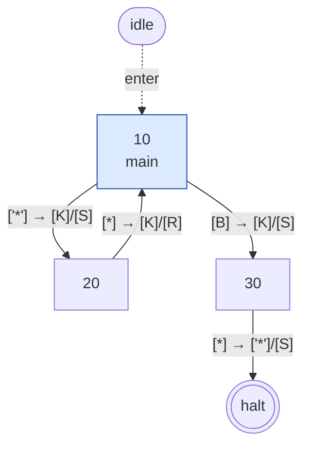
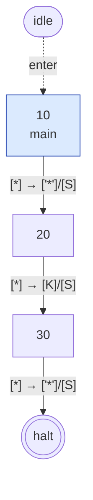
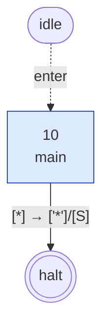
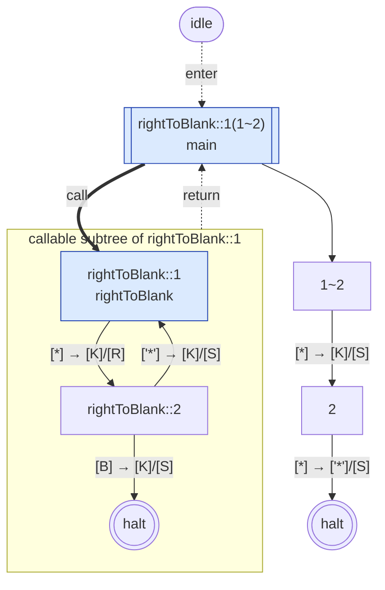
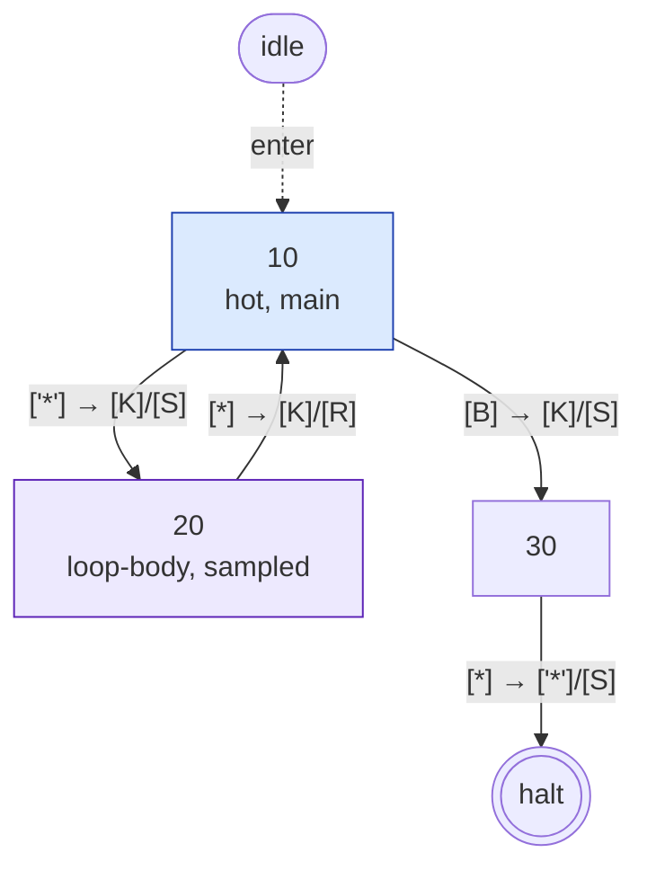
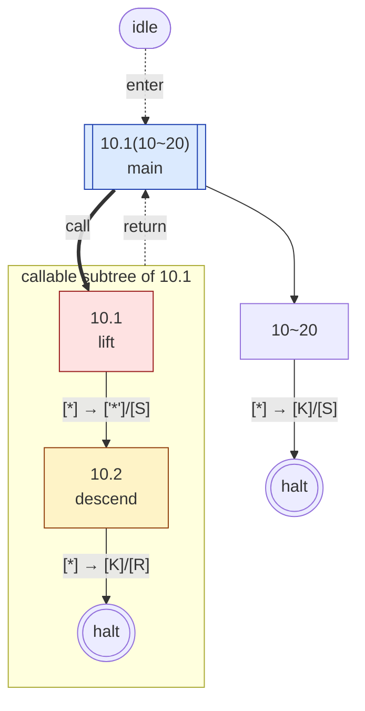
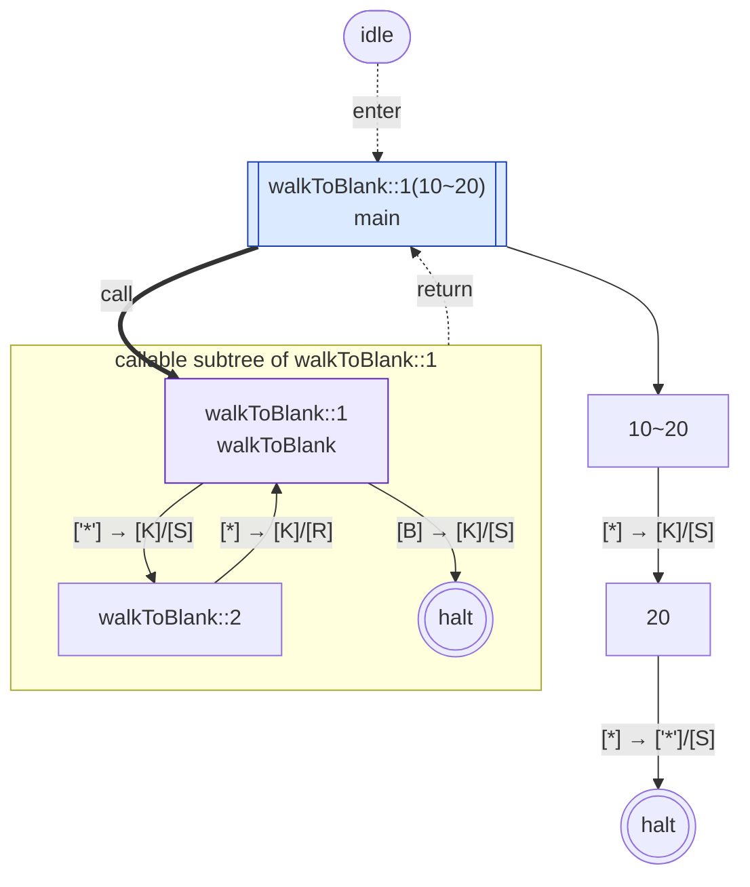

# @post-machine-js/machine

[](https://github.com/mellonis/post-machine-js/actions/workflows/main.yml)


A Post machine — a 2-symbol Turing-machine variant with a numbered-instruction program model — built on top of [`@turing-machine-js/machine`](https://github.com/mellonis/turing-machine-js).

<details>
<summary>Table of contents</summary>

- [Install](#install)
- [Quick start](#quick-start)
- [Classes](#classes) — [`PostMachine`](#postmachine) · [`Tape`](#tape)
- [Constants](#constants)
- [Custom symbols](#custom-symbols)
- [Commands](#commands) — [Classical](#classical-commands) · [Author's extensions](#authors-extensions)
- [Grouped instructions](#grouped-instructions)
- [Subroutines](#subroutines)
- [MachineState shape](#machinestate-shape)
- [Naming convention](#naming-convention)
- [Tags](#tags) — [`$tag` decorator](#inline-tag-decorator) · [Registry](#post-construction-registry) · [Auto-tag policy](#auto-tag-policy) · [Mermaid output](#mermaid-output)
- [Introspection and equivalence](#introspection-and-equivalence) — [Visualization](#visualization--tomermaid--statetograph) · [Structural summary](#structural-summary--summarizepostmachine) · [Behavioral equivalence](#behavioral-equivalence--equivalentpostmachines)
- [Debugging](#debugging)
- [Links](#links)

</details>

## Install

`@post-machine-js/machine` declares `@turing-machine-js/machine` as a **peer dependency**, so both share a single instance of the upstream engine. The upstream library has runtime singletons (`haltState`, `ifOtherSymbol`, and the `Symbol`-keyed `movements` constants) whose identity is checked at runtime; duplicate copies in the bundle would break those checks.

```sh
npm install @turing-machine-js/machine @post-machine-js/machine
```

## Quick start

The Post machine alphabet has only two symbols — blank (` `) and mark (`*`). A program is a numbered map of instructions. The example below walks the head right while the cell under it is marked, then writes a mark on the first blank it finds:

```javascript
import { PostMachine, check, mark, right, stop, Tape } from '@post-machine-js/machine';

const machine = new PostMachine({
  10: check(20, 30),  // marked → go to 20 (step right); blank → go to 30 (mark)
  20: right(10),      // step right, then re-check at 10
  30: mark,           // write '*'; falls through to 40
  40: stop,
});

machine.replaceTapeWith(new Tape({
  alphabet: machine.tape.alphabet,
  symbols: ['*', '*', ' '],
}));

await machine.run();
console.log(machine.tape.symbols.join('').trim()); // ***
```

Each instruction is a command. Used bare (`mark`, `right`, `erase`), it falls through to the next numbered instruction; called with an index (`mark(20)`), it jumps to instruction `20`. `check(ix1, ix0)` branches — `ix1` if the current cell is marked, else `ix0`. `stop` halts.

The state graph for the example above (`toMermaid(State.toGraph(machine.initialState, machine.tapeBlock))`):



Reading the diagram:

**Nodes.** Each `s\d+` is a Mermaid-internal node ID; the bracketed/parenthesized text is the state's display label. `s0` is always `haltState`. Node shapes:
- `(((label)))` — halt state
- `["label"]` — intermediate (and now also entry) state
- `([idle])` — the `idle` sentinel that marks the entry point via a dotted `idle -. enter .-> s_initial` edge
- (Wrappers produced by `withOverriddenHaltState` use a `[[bare(continuation)]]` double-square node sitting OUTSIDE its callable subtree's `subgraph w_N["callable subtree of NAME"]` block — see the [Subroutines](#subroutines) section.)

The labels are PostMachine's instruction-derived names — `"10"`, `"20"`, `"30"` map directly to the instruction indices in the program. The wrapper composite shape (`"<outer>(<continuation>)"`) doesn't appear in this example because there are no calls or groups; see the [Subroutines](#subroutines) section for that. The `40: stop` instruction is elided — `stop` halts the machine, so the transition from `30: mark` flows straight to halt rather than through an intermediate state.

**Edges.** Compact `read → write/move` syntax with bracketed tokens:
- **Read side**: `['*']` is the literal mark symbol; `[B]` is the blank symbol; `[*]` is `ifOtherSymbol` — the any-other catch-all (or sole-edge match-all on a state with only one outgoing transition).
- **Write side**: `[K]` is "keep" (no write); `[E]` is "erase" (write the blank); `['*']` (and `[' ']` for blank) is a literal symbol write.
- **Move**: `[S]` = stay, `[L]` = left, `[R]` = right.

## Classes

### PostMachine

The runtime. Subclasses `TuringMachine` from `@turing-machine-js/machine`: the constructor walks the numbered instruction list, materializes a state graph using the upstream `State` and `Reference` primitives, and runs it. Subroutines are introduced by adding string-keyed groups to the program (see [Subroutines](#subroutines) below).

**Constructor.** `new PostMachine(instructions, options?)` — `instructions` is the numbered-instruction map (with optional string-keyed subroutine groups); `options` is `{ blankSymbol?, markSymbol? }` (see [Custom symbols](#custom-symbols)).

**Methods.**
- `run({ stepsLimit?, onStep?, onPause? } = {})` → `Promise<void>`. Runs to halt or until `stepsLimit` (default `1e5`) is exhausted. `onStep(m: MachineState)` fires once per applied transition; `onPause` forwards to the engine's debugger (see [Debugging](#debugging)).
- `runStepByStep({ stepsLimit? } = {})` → `Generator<MachineState>`. Synchronous step-at-a-time execution; the consumer drives the loop with `for ... of` or `.next()`.
- `replaceTapeWith(newTape)` — swap the active tape. Build the new tape against `machine.tape.alphabet` so symbol identities match the machine's interned alphabet.

**Properties.**
- `tape` — the active `Tape`. Equivalent to `tapeBlock.tapes[0]`.
- `tapeBlock` — the upstream `TapeBlock` wrapping `tape`. Pass to upstream utilities (`State.toGraph`, `summarize`, `equivalentOn`) when reaching past PostMachine.
- `initialState` — the entry `State` of the assembled state graph. Pass alongside `tapeBlock` to the upstream graph utilities.

### Tape

Reexported from [`@turing-machine-js/machine`](https://github.com/mellonis/turing-machine-js/tree/master/packages/machine). Post machine tapes use a 2-symbol alphabet — `' '` / `'*'` by default, but **the two glyphs are configurable per machine instance** (see [Custom symbols](#custom-symbols)). Whatever pair you pass in becomes the blank/mark for that machine; `mark`, `erase`, `check`, and the engine's `Tape` all read those glyphs from the per-instance alphabet at build time. Useful for rendering / visualization (e.g. the `demo.machines.mellonis.ru` interactive playground lets users choose any two characters, then runs the machine against tapes built on that alphabet), interop with other tape formats, or didactic clarity.

Always build initial tapes against `machine.tape.alphabet` so the symbol identities match the machine's interned alphabet — even when you're using the defaults, since `Alphabet` instances aren't structurally interchangeable.

## Constants

The default values used by new PostMachine instances. Custom-symbol machines (see [Custom symbols](#custom-symbols)) override them at the per-instance level — reach for `machine.tape.alphabet.blankSymbol` and friends when you need the *active* glyphs for a specific machine. The module-level exports are useful for code that wants the canonical defaults without instantiating.

* `alphabet` — the default `Alphabet` instance for Post-machine tapes (` `, `*`).
* `blankSymbol` — the default blank symbol, ` ` (space).
* `markSymbol` — the default mark symbol, `*`.

## Custom symbols

The Post machine semantics are independent of which two characters represent blank and mark. Pass an options object as the second constructor argument to swap the glyphs — useful for rendering, interop with other formats, or didactic clarity. Both must be single characters and distinct from each other; passing neither (or `undefined` / `null`) falls back to the defaults.

```javascript
import { PostMachine, check, mark, right, stop, Tape } from '@post-machine-js/machine';

const machine = new PostMachine(
  {
    10: check(20, 30),
    20: right(10),
    30: mark,
    40: stop,
  },
  { blankSymbol: '.', markSymbol: '#' },
);

machine.replaceTapeWith(new Tape({
  alphabet: machine.tape.alphabet,
  symbols: ['#', '#', '.'],
}));

await machine.run();
console.log(machine.tape.symbols.join('').replace(/\.+$/, '')); // ###
```

`mark`, `erase`, and `check` read the chosen symbols from the per-instance alphabet at build time; subroutines and grouped instructions inherit the same alphabet. Build the initial tape against `machine.tape.alphabet` (as in the snippet above) so your tape symbols are validated against the same alphabet the machine was built with.

## Commands

Each command has two forms: **bare** (`mark`) — falls through to the next position in its containing scope (the next numbered instruction in the map, or the next item in an [array group](#grouped-instructions)); or **with an explicit index** (`mark(20)`) — jumps to instruction `20`. The bare form is what you use when "next entry in this scope" is what you want; the indexed form is for back-edges, branches, and explicit jumps. A `—` in either form column means that form doesn't exist for that command.

The first table is the **canonical instruction set** of a Post(–Turing) machine per Post's 1936 paper. The second is **the author's extensions** added on top of the classical machine in this implementation — subroutines (`call`) and a placeholder (`noop`); both are conveniences, not part of the original specification.

### Classical commands

| Command | Bare form | Indexed form | Behavior |
|---|---|---|---|
| `check` | — | `check(ix1, ix0)` | Branch on the current cell: marked → instruction `ix1`, blank → instruction `ix0` |
| `erase` | `erase` | `erase(ix)` | Write the blank symbol; fall through / jump to `ix` |
| `left` | `left` | `left(ix)` | Move the head left; fall through / jump to `ix` |
| `mark` | `mark` | `mark(ix)` | Write the mark symbol; fall through / jump to `ix` |
| `right` | `right` | `right(ix)` | Move the head right; fall through / jump to `ix` |
| `stop` | `stop` | — | Halt the machine |

`check` requires both branch targets so has no bare form; `stop` always halts so has no indexed form.

### Author's extensions

| Command | Bare form | Indexed form | Behavior |
|---|---|---|---|
| `call` | `call(name)` | `call(name, ix)` | Invoke subroutine `name`; fall through / jump to `ix` afterwards |
| `noop` | `noop` | `noop(ix)` | Do nothing; fall through / jump to `ix` |

`call` and the [Subroutines](#subroutines) feature add procedure-like reuse to the classical numbered-instruction model. `noop` is the placeholder of choice: useful for reserving instruction numbers in a worked example, padding a sketch, or as a labelled jump target. (Bare `noop` has no classical analog; `noop(ix)` corresponds to Post's unconditional jump.)

<details>
<summary><code>noop</code> in the graph — fall-through and unconditional jump</summary>

```javascript
const machine = new PostMachine({
  10: mark,
  20: noop,
  30: mark,
  40: stop,
});
```



`s2` is the noop. Its single outgoing edge `[*] → [K]/[S]` is the signature: read anything, keep the cell (`K`, no write), stay in place (`S`, no move) — then fall through to instruction 30. The marks at `s1` and `s3` write `'*'` and move stay; the structural difference between a "useful" command and `noop` is the write cell (`'*'` vs `K`).

Indexed form `noop(40)` rewires the fall-through to instruction 40 — Post's unconditional jump:

```javascript
const machine = new PostMachine({
  10: noop(40),
  20: mark,
  30: mark,
  40: stop,
});
```


Instruction `10` jumps directly to `40` (the trailing stop). Instructions `20` and `30` are unreachable — they don't appear in the graph at all. (`toGraph` only emits reachable states; unreachable ones are silently dropped.)

</details>

<details>
<summary>Trailing <code>stop</code> doesn't get its own node</summary>

```javascript
const machine = new PostMachine({
  10: mark,
  20: stop,
});
```



Notice: no `s20` node. `stop` halts the machine, so `s1` (`10: mark`) transitions directly to `s0(((halt)))` — there's no intermediate state for the `stop` instruction. The trailing `stop` is **elided** in the structural emit: it's a halt routing convention, not a State.

The lookup API is asymmetric in a useful way — `pm.stateAt({ instructionIndex: 20 })` for this machine resolves to `haltState` (the canonical halt singleton), not `undefined`. The graph doesn't render `s20`, but the path still resolves.</details>

## Grouped instructions

Several commands can share a single instruction number by passing them as an array:

```javascript
import { PostMachine, mark, right, stop, Tape } from '@post-machine-js/machine';

const machine = new PostMachine({
  1: [mark, right, mark],   // mark, step right, mark — all under label 1
  2: stop,
});

machine.replaceTapeWith(new Tape({
  alphabet: machine.tape.alphabet,
  symbols: [' ', ' ', ' '],
  position: 0,
}));

await machine.run();
console.log(machine.tape.symbols.join('').trim()); // **
```

Bare commands inside a group fall through to the next item in the array; the last item falls through to the next *top-level* instruction (`2: stop` here). This is sugar for inlining a fixed sequence without giving each step its own top-level number.

**Inside a group, only bare forms work for movement / write commands.** Indexed forms (`mark(20)`, `right(10)`, `call('sub', 5)`, ...) throw at construction time — an explicit jump conflicts with the group's sequential fall-through semantics.

**`check` and `stop` always throw inside a group**, regardless of form. Branching and halting are control-flow boundaries that need their own top-level instruction number.

## Subroutines

A subroutine is a string-keyed group of numbered instructions — reusable logic invoked from the top-level program with `call(name)`. The minimum syntax: a single subroutine called once.

```javascript
import { PostMachine, call, check, mark, right, stop, Tape } from '@post-machine-js/machine';

const machine = new PostMachine({
  rightToBlank: {
    1: right,
    2: check(1, 3),
    3: stop,
  },
  1: call('rightToBlank'),
  2: mark,
  3: stop,
});

machine.replaceTapeWith(new Tape({
  alphabet: machine.tape.alphabet,
  symbols: ['*', '*', ' '],
}));

await machine.run();
console.log(machine.tape.symbols.join('').trim()); // ***
```

The state graph as the engine emits it — the subroutine and the wrapping `withOverriddenHaltState` composition are visible:



The `call('rightToBlank')` step at instruction 1 is built using the engine's `withOverriddenHaltState` composition primitive: the subroutine's halt is overridden to point at the next top-level instruction (instead of terminating the machine), so when the subroutine "halts" it actually returns to top-level execution at instruction 2.

Reading the diagram (engine v7's callable-subtree emit + PostMachine's drop-acyclic-hopper rule from [#85](https://github.com/mellonis/post-machine-js/issues/85)):
- The labels are PostMachine's instruction-derived names: `"rightToBlank::1"`/`"rightToBlank::2"` for the subroutine body, `"2"` for the top-level mark, `"1~2"` for the continuation, and the composite `"rightToBlank::1(1~2)"` on the wrapper (the `[[…]]` double-square node `s4`). The `<br>main` and `<br>rightToBlank` suffixes are auto-tag annotations (#86) — the entry points of the top-level program and the subroutine, respectively. The `s\d+` node IDs are still auto-generated and shift between runs.
- The wrapper `s4[["rightToBlank::1(1~2)<br>main"]]` is the **call site** — it sits OUTSIDE the subgraph. The `idle -. enter .-> s4` edge marks it as the top-level entry; the auto-tag `main` reflects that role. The double-square `[[…]]` shape signals "wrapper" — a state produced by `withOverriddenHaltState`. The wrapper has no transitions of its own; it delegates to the bare via the bold `== "call" ==>` arrow. Under [#85](https://github.com/mellonis/post-machine-js/issues/85), the wrapper now wraps `rightToBlank::1` (the first instruction) directly — there is no v6.x "hopper" anchor for this acyclic-in-the-call-graph case.
- The `subgraph w_1["callable subtree of rightToBlank::1"]` is the **callable body** — it contains the bare entry `s1` (auto-tagged `rightToBlank` as the subroutine entry), the second-instruction state `s2`, and a frame-local halt marker `c1`. The body's halt-bound transition (`s2 -- "[B]" --> c1`) lands on `c1`, not on the real `s0` halt.
- The dotted `w_1 -. "return" .-> s4` is the **return arrow** — when the body lands on `c1`, control returns to the wrapper `s4`. Then `s4 --> s3` (the solid wrapper-to-override arrow) hands off to the continuation. This replaces the alpha.1 `-. onHalt .->` keyword.
- `s3` is the continuation; it falls through (keep+S) to `s5`.
- `s5` is the `mark` instruction at top-level 2 (writes `'*'`, then transitions to halt — the trailing top-level `3: stop` is what produces that halt edge).
- The trailing `classDef tag_main` / `classDef tag_rightToBlank` + `class` lines are auto-tag styling (see [Auto-tag policy](#auto-tag-policy)).

That's just syntax — for one call site, inlining is equivalent. Subroutines earn their keep when the same logic appears at multiple sites or when symmetric variants share a shape. Example: extend a marked region by one cell on each side, using mirrored `walkRightToBlank` / `walkLeftToBlank` helpers.

```javascript
import { PostMachine, call, check, left, mark, right, stop, Tape } from '@post-machine-js/machine';

const extend = new PostMachine({
  walkRightToBlank: {
    1: check(2, 3),
    2: right(1),
    3: stop,
  },
  walkLeftToBlank: {
    1: check(2, 3),
    2: left(1),
    3: stop,
  },
  10: call('walkRightToBlank'),  // find blank to the right of the marked region
  20: mark,                       // extend rightward
  30: call('walkLeftToBlank'),   // back through the region to the left blank
  40: mark,                       // extend leftward
  50: stop,
});

extend.replaceTapeWith(new Tape({
  alphabet: extend.tape.alphabet,
  symbols: [' ', '*', ' '],
  position: 1,
}));

await extend.run();
console.log(extend.tape.symbols.join('')); // ***
```

The two helpers have the same shape — a `check`/move/loop pair — with mirrored direction commands. Without subroutines, that loop body appears twice in the top-level program with `right` and `left` swapped; the structural cost is real and `summarize` makes it visible (see [Structural summary](#structural-summary--summarize)).

For a single subroutine called from MULTIPLE sites — the other archetypal use case — see the [duplicate-marked-region example](../../README.md#an-example-with-subroutines) in the root README.

## MachineState shape

PostMachine's `onStep` and `onPause` callbacks receive an extended `MachineState` with two additional fields:

| Field             | Type     | Meaning                                                                                  |
|-------------------|----------|------------------------------------------------------------------------------------------|
| `arrivalPath`     | `Path`   | The instruction path that just transitioned to the current state                          |
| `candidatePaths`  | `Path[]` | All paths whose references resolve to the current state (informational; multiple for shared states) |

These fields disambiguate state-sharing (the hash-cache dedup). When two instructions produce structurally-identical transitions, they share a State; `arrivalPath` tells you which instruction the engine just transitioned through, while `candidatePaths` tells you the full sharing set.

**Example.**

```javascript
import { PostMachine, mark, stop } from '@post-machine-js/machine';

const m = new PostMachine({
  10: mark,
  20: stop,
});

await m.run({
  onStep: (s) => {
    console.log('at:', s.arrivalPath, 'shared with:', s.candidatePaths);
  },
});
```

The `Path` type and the `parsePath`/`formatPath` helpers are exported from `@post-machine-js/machine` — see the [Naming convention](#naming-convention) section for the path-string format.

## Naming convention

PostMachine names every state it constructs by instruction index, so `toMermaid` output, `summarize` output, and `MachineState.name` carry user-meaningful information.

**Rules** — given a state's place in the instruction tree, its name is:

| Construct                                       | Top-level                    | Inside subroutine `foo`      |
|-------------------------------------------------|------------------------------|------------------------------|
| Atomic instruction at index `N`                 | `"N"`                        | `"foo::N"`                   |
| Subroutine hopper (entry forwarder)             | `"sub"`                      | `"foo::sub"`                 |
| Group at instr `O`, inner index `I`             | `"O.I"`                      | `"foo::O.I"`                 |
| Continuation: from `X` to `Y`                   | `"X~Y"`                      | `"foo::X~foo::Y"`            |
| Continuation: tail-position                     | `"X~halt"`                   | `"foo::X~halt"`              |
| Call wrapper composite (engine auto-wraps in parens) | `"sub(X~Y)"` / `"sub(X~halt)"` | `"foo::sub(foo::X~foo::Y)"`   |
| Group wrapper composite                         | `"O.1(O~Y)"` / `"O.1(O~halt)"` | `"foo::O.1(foo::O~foo::Y)"`   |

**Separators in user-meaningful labels:**
- `::` — subroutine scope (lexical nesting), like C++/Rust's scope-resolution operator. `foo::bar::1` reads as "instruction 1 inside subroutine `bar`, which is defined inside subroutine `foo`".
- `.` — group inner-step ordinal. `50.1`, `50.2`, etc. are the sequential commands inside a group at instruction `50`.
- `~` — continuation. `10~30` reads as "after the wrapper at instruction 10 finishes, forward to instruction 30". Tail-position uses `~halt`.
- `(` / `)` — engine-internal `withOverriddenHaltState` composition (outer state wrapping the override target in parens). The engine auto-builds wrapper composites in this shape; user code never writes parens directly into state names.

User-provided subroutine names are constrained to identifier characters (`/^[A-Z$_][A-Z0-9$_]*$/i`), so none of these separators can collide with user input.

**Reading a wrapper composite.** Example: `"foo(10~40)"`.

- The outer (bare) part is everything before the opening paren: `"foo"` (the subroutine hopper). The override is the parenthesized inner: `"10~40"` (the continuation state).
- Split the override at `~`: caller = `"10"` (the call-site instruction), target = `"40"` (where control resumes).

So `"foo(10~40)"` describes: "a wrapper around the `foo` subroutine entry, which on halt forwards from instruction 10 to instruction 40."

For a more complex example, `"outer::inner::deepest(outer::inner::1~halt)"`:
- Outer = `"outer::inner::deepest"` — a deeply-nested subroutine hopper (three levels of lexical nesting).
- Override = `"outer::inner::1~halt"` — the call site at `outer::inner::1`, tail-position (forwards to halt).

**Quick example.**

```javascript
const m = new PostMachine({
  10: call('foo', 30),
  20: stop,
  30: stop,
  foo: { 1: stop },
});
// m.initialState.name === "foo(10~30)"
```

### State sharing across structurally-identical instructions

PostMachine caches state nodes by command shape, so two instructions producing structurally-identical transitions (same command kind, same next-instruction target) share a single underlying `State` object. The shared state carries the name of the *first-processed* instruction. Behavior is identical regardless of which instruction control arrives through, but `MachineState.name` may report the canonical instruction's name rather than the caller's instruction index.

For programmatic lookup by instruction index, use `pm.candidatesFor(path)` (construction-time) or read `MachineState.candidatePaths` from an `onStep` / `onPause` callback (runtime). See [Path-based resolver](#path-based-resolver) and [MachineState shape](#machinestate-shape).

### Engine v7 alignment

Engine v7 (upstream `@turing-machine-js/machine`) changed the wrapper composite shape from `A>B` to `A(B)` (paren-based). PostMachine's naming convention was designed to survive that change: none of our separators (`::`, `.`, `~`) collide with the new paren grammar, so only the *wrapper composite emit* shifted (e.g., the v6.x `"foo>10~40"` is now `"foo(10~40)"`). The names PostMachine constructs internally — and the rules in the table above — are unchanged. v7's `toMermaid` output also adopted a callable-subtree model: the wrapper is a `[[bare(continuation)]]` call site OUTSIDE the subgraph, with a bold `==> "call"` arrow into the bare's subtree and a dotted `-. "return" .->` arrow back to the wrapper. Replaces v6.x's composite-named entry node.

## Tags

Tags are out-of-band string labels attached to states. They don't change runtime behavior — they layer semantic meaning over the auto-generated path-derived names ([Naming convention](#naming-convention)) for two surfaces:

- **Mermaid diagrams** — `toMermaid` emits tags as `<br>`-suffixed annotations on node labels plus `classDef`/`class` lines for visual grouping. A reader who didn't write the program sees what the structurally important entry points are without re-deriving them from the instruction list.
- **Programmatic introspection** — `pm.findByTag(...)` retrieves paths by tag; debugger / analysis code can use tags as stable handles independent of state IDs.

Three ways to apply tags: the **inline `$tag` decorator** at construction, the **`pm.tag` registry** post-construction, and the **auto-tag policy** which marks each program's / subroutine's entry point automatically.

### Inline `$tag` decorator

`$tag(...tags, command)` wraps a command with one or more tags. The tags apply to the resulting State; no extra graph node is created. The leading `$` flags it visually as a decorator (not a primitive command).

**Wrapping a single command.** The common case — one tag per state, applied per instruction:

```javascript
import { PostMachine, $tag, check, mark, right, stop } from '@post-machine-js/machine';

const machine = new PostMachine({
  10: $tag('hot', check(20, 30)),               // tag a single state
  20: $tag('loop-body', 'sampled', right(10)),  // variadic — many tags at once
  30: mark,
  40: stop,
});

console.log(machine.tagsOf({ instructionIndex: 10 }));
// ['hot', 'main'] — inline 'hot' applied at producer time, then 'main' auto-tag
```



`s1` carries two tags (`hot` from `$tag` + `main` from auto-tag) — the engine emits them comma-separated in the label and applies BOTH `classDef` lines via two `class s1 …` directives. Tag composition is additive.

**Per-member in a group.** `$tag` rejects wrapping a group as a whole (`$tag('foo', [mark, right])` throws). Tag each member individually instead — the inner tags land on the per-member states inside the group's callable subtree:

```javascript
import { PostMachine, $tag, mark, right, stop } from '@post-machine-js/machine';

const machine = new PostMachine({
  10: [$tag('lift', mark), $tag('descend', right)],
  20: stop,
});

console.log(machine.tagsOf({ instructionIndex: 10, groupInstructionIndex: 1 }));
// ['lift']
console.log(machine.tagsOf('10'));
// ['main'] — the outer wrapper at path '10' carries the auto-tag for the top-level entry
```



The group expands into a `withOverriddenHaltState` chain wrapped in a callable subtree (same shape as a subroutine call). The wrapper `s7` is the top-level entry (auto-tagged `main`); the inner states `s4` (`lift`) and `s5` (`descend`) carry their per-member tags inside the subgraph. The group's outer path `'10'` resolves to the wrapper; group-inner paths use the `{ instructionIndex: 10, groupInstructionIndex: N }` shape.

Passing bare `$tag` (without invoking it) as an instruction or as a group member also throws — with a message pointing at the correct form.

### Post-construction registry

```typescript
pm.tag(path: Path | string, ...tags: string[]): void;
pm.untag(path: Path | string, ...tags: string[]): void;
pm.tagsOf(path: Path | string): readonly string[];
pm.findByTag(tag: string): Path[];
```

`tag` / `untag` are variadic (one call adds/removes any number of tags). `tagsOf` returns a frozen snapshot; `findByTag` returns all paths whose state currently carries that tag. All four resolve `path` the same way as [`pm.stateAt`](#path-based-resolver) — string form (`'10'`, `'sub::1'`) or object form (`{ instructionIndex: 10 }`).

```javascript
import { PostMachine, mark, stop } from '@post-machine-js/machine';

const machine = new PostMachine({ 10: mark, 20: mark, 30: stop });
machine.tag('10', 'checkpoint');
machine.tag('20', 'checkpoint', 'hot');

console.log(machine.tagsOf('20'));         // ['checkpoint', 'hot'] — no 'main' (20 is not the entry)
console.log(machine.findByTag('checkpoint').length); // 2

machine.untag('20', 'hot');
console.log(machine.tagsOf('20'));         // ['checkpoint']
```

`pm.tag(...)` and `$tag(...)` compose: tags from both sources accumulate on the same state. Inline tags are applied at construction, before any post-construction `pm.tag` call sees the state.

### Auto-tag policy

At construction, PostMachine auto-tags the **entry point** of each program/subroutine:

| Path | Auto-tag |
|---|---|
| Top-level entry (e.g., the first numbered instruction `1` or `10`) | `'main'` |
| Each subroutine's entry (e.g., `sub::1`, `rightToBlank::1`) | the subroutine name (e.g., `'sub'`, `'rightToBlank'`) |

Non-entry instructions and group inner states stay clean. Halt-resolving paths (`stop`-only entries) are also skipped, because `stop` resolves to the engine's globally-shared `haltState` singleton — tagging it would leak across all PostMachine instances. The policy is mechanical and intentionally minimal: it anchors the structural roles without cluttering diagrams.

```javascript
import { PostMachine, call, check, mark, right, stop } from '@post-machine-js/machine';

const machine = new PostMachine({
  10: call('rightToBlank'),
  20: stop,
  rightToBlank: { 1: check(2, 99), 2: right(1), 99: stop },
});

console.log(machine.tagsOf('10'));              // ['main']           — top-level entry
console.log(machine.tagsOf('rightToBlank::1')); // ['rightToBlank']   — subroutine entry
console.log(machine.tagsOf('rightToBlank::2')); // []                 — body, non-entry
console.log(machine.findByTag('main').map((p) => p.instructionIndex)); // [10]
```

### Mermaid output

When tags are present (auto-tag or user-applied), `toMermaid` emits them inline in node labels via `<br>` and as `classDef`/`class` lines for color grouping. The styling palette is hashed deterministically per tag name — same tag name → same color across runs. See the [Visualization](#visualization--tomermaid--statetograph) section below for full example output.

## Introspection and equivalence

The v3 utilities from [`@turing-machine-js/machine`](https://github.com/mellonis/turing-machine-js/tree/master/packages/machine) work directly against a `PostMachine`. For the two most common ones — `summarize` and `equivalentOn` — this package also ships Post-aware free-function wrappers (`summarizePostMachine`, `equivalentPostMachines`) that bind the standard arguments and hide the `getTapeBlock`-must-clone footgun. **Prefer the wrappers for typical use.** The bare upstream functions are still re-exported here for advanced cases.

### Visualization — `toMermaid` + `State.toGraph`

```javascript
import { PostMachine, State, toMermaid, check, mark, right, stop } from '@post-machine-js/machine';

const machine = new PostMachine({
  10: check(20, 30),
  20: right(10),
  30: mark,
  40: stop,
});

const mermaid = toMermaid(State.toGraph(machine.initialState, machine.tapeBlock));
console.log(mermaid.split('\n')[0]); // flowchart TD
```

The full rendered emit for this machine:


(Same machine as the [Quick start](#quick-start) example — see that section for the node/edge-shape reading guide.)

For the raw `Graph` as input to other tools (analysis, custom rendering, alternative serializations), use `State.toGraph(machine.initialState, machine.tapeBlock)` directly. The companion `fromMermaid` and `State.fromGraph` are also re-exported for round-trip workflows — load a Mermaid blob, get a `Graph` back, build a runnable machine from it. Under engine v7 ([#174](https://github.com/mellonis/turing-machine-js/issues/174)), the round-trip is both behaviorally lossless AND bytewise stable for wrapped states (state IDs auto-reassign on each pass, but the emit shape — including shared-bare deduplication — is deterministic).

### Structural summary — `summarizePostMachine`

`summarizePostMachine(machine)` returns counts about the assembled state graph: `stateCount`, `transitionCount`, `compositionEdgeCount`, `maxCompositionDepth`, `selfLoopCount`, `hasCycles`, `tapeCount`, `alphabetCardinalities`. For a PostMachine, `tapeCount` is always `1` and `alphabetCardinalities` is always `[2]` (one tape, two symbols — blank and mark); the interesting fields are the rest.

The typical use is comparing two implementations of the same algorithm — for example, an inline version against one factored through a subroutine:

```javascript
import { PostMachine, summarizePostMachine, call, check, mark, right, stop } from '@post-machine-js/machine';

// Both machines walk right to the first blank cell and mark it.

const inline = new PostMachine({
  10: check(20, 30),
  20: right(10),
  30: mark,
  40: stop,
});

const withSubroutine = new PostMachine({
  walkToBlank: {
    1: check(2, 3),
    2: right(1),
    3: stop,
  },
  10: call('walkToBlank'),
  20: mark,
  30: stop,
});

const a = summarizePostMachine(inline);
const b = summarizePostMachine(withSubroutine);

console.log(a.stateCount, a.compositionEdgeCount, a.maxCompositionDepth);
// 4 0 0 — inline: 4 states, no composition

console.log(b.stateCount, b.compositionEdgeCount, b.maxCompositionDepth);
// 6 1 1 — subroutine: 2 more states; 1 composition edge from `call` (depth 1)
```

Both programs do the same thing on the same input. This particular comparison is the **worst case for subroutines**: a single call site (no reuse benefit) with a small body — so the `withOverriddenHaltState` wrapper overhead per call (~2 states under engine v7's callable-subtree emit + PostMachine's drop-acyclic-hopper rule from [#85](https://github.com/mellonis/post-machine-js/issues/85): the wrapper node and the continuation; the v6.x hopper is dropped for the common case of a plain leading command) shows up as pure cost. Subroutines start saving states when reuse is real and the body amortizes the wrapper overhead — see the [extend example](#subroutines) above for symmetric variants and the [duplicate-marked-region example](../../README.md#an-example-with-subroutines) in the root README for true multi-call.

The two state graphs as the engine emits them — what the numbers above are summarizing:

<details>
<summary><code>inline</code> — flat 4-state graph, no composition</summary>


`s1` is `check`; on `'*'` it loops via `s2` (`right`); on blank it falls to `s3` (`mark`) → halt. Four nodes, one back-edge, zero subgraphs.

</details>

<details>
<summary><code>withSubroutine</code> — wrapper + callable subtree + continuation</summary>



The two extra nodes vs inline that drive `stateCount: 4 → 6`:
- **`s7[["walkToBlank::1(10~20)"]]`** — the wrapper / call site, OUTSIDE the subgraph. Composite name `walkToBlank::1(10~20)` reflects that PostMachine drops the v6.x "hopper" anchor for acyclic subroutines with a plain first instruction (see [#85](https://github.com/mellonis/post-machine-js/issues/85)) — the wrapper wraps `walkToBlank::1` directly, saving one State.
- **`s6["10~20"]`** — the continuation that PostMachine synthesizes between the `call('walkToBlank')` site at instruction `10` and the next top-level instruction `20`.

The subroutine body (`s4`, `s5`) inside `subgraph w_4` mirrors `inline`'s `s1`, `s2` loop structurally — same algorithm, same internal back-edge. The extra cost is purely the wrapper + continuation machinery. `compositionEdgeCount: 0 → 1` and `maxCompositionDepth: 0 → 1` come from the single `withOverriddenHaltState` wrapper.

(Subroutines with `1: stop`, a leading `call(...)`, a leading group `[...]`, or that participate in a call-graph cycle keep the hopper as a forward-declaration anchor. The common case — plain leading command — drops it.)

</details>

What `summarizePostMachine` actually surfaces is the **structural trade-off**, not just state count: `compositionEdgeCount` and `maxCompositionDepth` go to zero in the inline version (everything is one flat graph) and become non-zero with subroutines (`call` creates a composition edge; nesting goes deeper). Use those fields to reason about the structure of reuse independently of raw size.

`summarizePostMachine(machine)` is sugar for `summarize(machine.initialState, machine.tapeBlock)`. The bare `summarize` is also re-exported for callers who already hold a `(state, tapeBlock)` pair.

### Behavioral equivalence — `equivalentPostMachines`

`equivalentPostMachines(reference, candidate, cases, options?)` runs both PostMachine instances against the same list of input tapes and reports per-case agreement, first-divergence step, and per-side step counts.

```javascript
import { PostMachine, equivalentPostMachines, check, mark, right, stop } from '@post-machine-js/machine';

const reference = new PostMachine({
  10: check(20, 30), 20: right(10), 30: mark, 40: stop,
});
const candidate = new PostMachine({
  10: check(20, 30), 20: right(10), 30: stop,  // forgot to mark
});

const report = equivalentPostMachines(reference, candidate, ['** ']);
console.log(report.allAgree); // false
```

Each case string is loaded onto a fresh clone of the originating PostMachine's tapeBlock per run (the wrapper handles the cloning — required because state-graph symbols are interned per-block). Cross-alphabet comparison and the `compareOutputs` / `compareSnapshots` options are passed through to upstream `equivalentOn`; see [equivalence specs](https://github.com/mellonis/turing-machine-js/blob/master/packages/machine/src/utilities/equivalence.spec.ts) for full option semantics.

The bare `equivalentOn` is also re-exported. Use it directly when you need a non-PostMachine `Runnable` on either side (e.g., comparing a `PostMachine` against a hand-rolled `TuringMachine`).

## Path-based resolver

`PostMachine` exposes three construction-time queries for addressing states by instruction path.

```javascript
import { PostMachine, mark, stop } from '@post-machine-js/machine';

const pm = new PostMachine({ 10: mark, 20: stop });

pm.stateAt('10');               // the State for instruction 10
pm.hasState('10');              // true
pm.hasState('999');             // false (never throws)
pm.candidatesFor('10');         // [{ instructionIndex: 10 }]
```

Both string and object forms work for paths:

```javascript
pm.stateAt({ instructionIndex: 10 });
pm.stateAt({ scope: 'sub', instructionIndex: 1 });
pm.stateAt({ scope: ['outer', 'inner'], instructionIndex: 1, groupInstructionIndex: 2 });
```

Returned States are the real engine States — `instanceof State`, usable with `State.toGraph`, `summarize`, and other engine utilities — but with `state.debug` set/get installed by PostMachine (see [Breakpoints](#breakpoints) below).

## Breakpoints

Register pauses by instruction path or by `haltState`:

```javascript
import { PostMachine, Tape, haltState, mark, right, check, stop } from '@post-machine-js/machine';

const pm = new PostMachine({
  10: check(20, 30),
  20: right(10),
  30: mark,
  40: stop,
});

pm.replaceTapeWith(new Tape({ alphabet: pm.tape.alphabet, symbols: ['*', '*', ' '] }));

pm.setBreakpoint('30', { before: true });

await pm.run({
  onPause: (m) => {
    // m.arrivalPath === { instructionIndex: 30 }
  },
});
```

Filters mirror the engine's `DebugConfig`:

```javascript
pm.setBreakpoint('10', { before: true });           // pause before every iteration
pm.setBreakpoint('10', { before: '*' });            // pause only on read '*'
pm.setBreakpoint('10', { before: ['*', ' '] });     // pause on either symbol
pm.setBreakpoint('10', { before: true, after: '*' });
```

Halt breakpoints:

```javascript
pm.setBreakpoint(haltState, { before: true });       // pause at halt entry
```

Management:

```javascript
pm.listBreakpoints();      // returns Breakpoint[]
pm.clearBreakpoint('10');  // remove a single registration
pm.clearBreakpoints();     // remove all
```

**State sharing.** When two instructions share an underlying State (hash dedup), setting a breakpoint on instruction 30 enables `state.debug` on the shared State — meaning the engine pauses on every visit. PostMachine's `onPause` wrapper consults the registry and *only* surfaces the pause when `m.arrivalPath` matches a registered path. Sibling-instruction visits silently resume.

### Lockdown semantics

`pm.setBreakpoint` is the structured channel. Direct `state.debug = X` writes are intercepted: on an un-shared State the assignment redirects to `setBreakpoint` (or `clearBreakpoint` if the value is `null`); on a shared State it throws with the candidate-path list, since the assignment is ambiguous:

```javascript
const pm = new PostMachine({ 10: mark, 20: stop });

pm.stateAt('10').debug = { before: true };
// equivalent to pm.setBreakpoint('10', { before: true })

pm.stateAt('10').debug = null;
// equivalent to pm.clearBreakpoint('10')
```

Direct writes on `haltState` throw (no PostMachine context for a redirect):

```javascript
haltState.debug = { before: true };
// throws — use pm.setBreakpoint(haltState, ...)
```

This single-channel model preserves a global invariant: `pm.listBreakpoints()` is the source of truth for what will fire `onPause`.

For the underlying engine reference — filter shapes, ordering (`before → step → after` on the same yield as of engine v6), the `haltState.debug.after` rejection — see [Debugging breakpoints](https://github.com/mellonis/turing-machine-js/tree/master/packages/machine#debugging-breakpoints) in the upstream README.

## Links

- [Post–Turing machine](https://en.wikipedia.org/wiki/Post%E2%80%93Turing_machine) on Wikipedia
- [@turing-machine-js/machine](https://github.com/mellonis/turing-machine-js/tree/master/packages/machine) — the upstream Turing-machine engine
